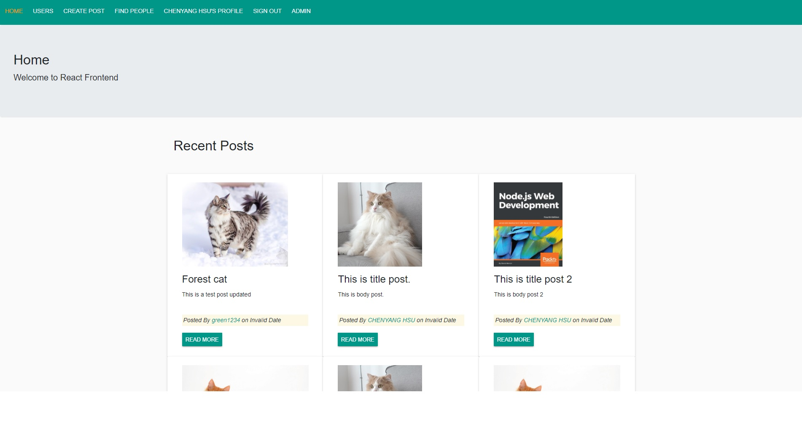

# MERN 社交網站
社交網站實作練習MERN_FullStack專案，使用 Restful Web API，涵蓋前後台，文章管理、分類、使用者等(CRUD)，登入/登出 Google身分登入 等功能。

## Demo
[Demo](https://social-network--front.herokuapp.com/)

## 後端程式碼
[node.js後端程式碼](https://github.com/Hankscr459/social_network_backend)

## 前台

### 使用技術

- React Framework
- React Hooks
- Bootstrap

### 使用插件

- react-google-login